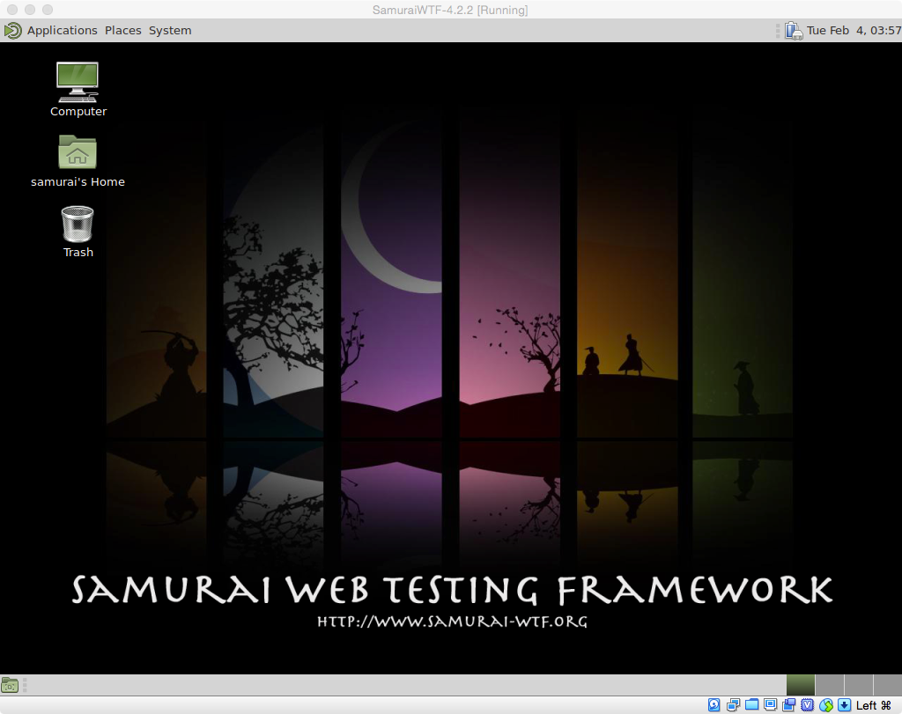

# Hacking your Way into Infosec / Security

What I find most amazing about the tech scene right now is how many people want to help others get into the field. So shoutout to Matt Carlson - Twitter: @Matt_Carlson - for sending me a TON of information including this link to Ochaun Marshall's - Twitter: @OchaunM - presentation [Hacking Your Way into Security](https://drive.google.com/file/d/1Bo4QoDvk5DdreRWmeolntVfoS3-HeXsA/view "Hacking Your Way into Security") from HackSec 2020

## Disclaimer
- Ochaun is talking about his new path in Security
- At the time of the presentation he is 1-1/2 years into the career
- Obviously everyone's career path will be different
- His "facet" is Red Team, Pentesting
- LOTS of other facets

## Cybersecurity Jobs
- Expected 3.5 million open positions by 2021
- 0% unemployment rate - They need people!
- Many positions have 6-figure salaries with just a Bachelor's
- If you want in the time is now

## Job Descriptions Want Unicorns
- Imposter Syndrome - Dunning-Kruger effect
  - Like all of IT this field will humble you
  - BUT you can do this!
  - You can't know it all at first
  - Learning comes with practice
  - You will learn & grow as you go!
  - The information is on the internet and everyone uses it
- Companies will ask for the world in a job description
  - REMEMBER: unicorns are mythical
  - You have to get them to BELIEVE you will do what it takes
  - You have to circumvent their desires

## Focus on PEOPLE, not the Hiring PROCESS
- Getting hired is a system and ALL systems can be HACKED!
- Find mentors
- Convince people you have what it takes

## Rethink Your Experience to Acquire Skills
- Employers will always value EXPERIENCE over EDUCATION
- Never stop learning: books, tutorials, classes
- Work on personal projects, hackathons, conferences
- Join industry organizations, go to meet-ups
- Find your online community: Twitter, Discord, Slack, etc
- Show you can handle Projects, Deadlines, Collaboration
- Do things that demonstrate your tech AND soft skills
- Do things that demonstrate your problem solving skills

## Let's Hack with Samurai-WTF - Demo & Resources
- Tools are great but you have to have targets to hack
  - Great Tools: VMs(Virtual Machines) & Kali Linux 
- We will use [Samurai-WTF](http://www.samurai-wtf.org/ "Samurai-WTF")
    
- Samurai-WTF is a Web Testing Framework
  - a set of tools and an environment to hack in
  - is supported on VirtualBox and VMware
  - a VM pre-configured as a web pentesting environment
  - includes tools used in all 4 steps of a web pentest
  - we will open Samurai-WTF inside of VirtualBox
- **DOWNLOAD** [VirtualBox](https://www.virtualbox.org/ "VirtualBox")
  - free and open-source hosted hypervisor for x86 virtualization
  - runs on Windows, macOS, Linux, Solaris and OpenSolaris
  - while the macos dmg file i downloaded installed easily on Yosemite\
    Yosemite did not like VirtualBox 6.1.2\
    However, VirtualBox 6.0.16 installed and opened fine! 
- **DOWNLOAD** the OVA at https://tini.si/samurai
  - this comes directly from the folks who make Samurai-WTF
  - OVA - Open Virtual Appliance file
      - used to store files associated with a VM
      - stored in the OVF (Open Virtualization Format) as a TAR archive
      - an OVA may include:
          - disk images (like VMDKs)
          - an OVF descriptor XML-based text file
          - ISOs or other resource files
          - certificate files
          - an MF manifest file
          - OVF is a standard, allowing VM program to use the OVF to export VM data files so they can be imported into a different application
          - EX: VirtualBox can export one of its VMs to an archive package with the .OVA file extension that includes an OVF and VMDK files
- **OPEN** the OVA file and import everything
  - the OVA opens Samurai-WTF 4.2.2 inside Debian (64bit) inside VirtualBox
  - Description section has the username and password
  - **CLICK** Samurai-WTF in the left pane to turn it on
  - you should see Debian start and then Samurai-WTF turn on
  - **ENTER** the username and password
  - NOTE: using VirtualBox will take at least 10GB of hard drive space
- **OPEN** the Samurai directory in the version of Samurai-WTF running in VirtualBox and you'll see file named bookmarks.html
  - **DOUBLE-CLICK** it and Firefox opens
  - the bookmarks are links to apps for practicing hacking!
- AGAIN, all the tools we need are already in Samurai-WTF
- To access the tools go to the upper left of the window under Applications > Samurai WTF 
  - **OPEN** [Burp Suite](https://portswigger.net/burp "Burp Suite") is a suite of cybersecurity tools and a Chrome Window
      - a manual toolkit for investigating web security
      - we're using the free Community Edition
  - **OPEN** a Chrome browser window
  - **SET UP** the Proxy Settings in the FoxyProxy Chrome extension\
    Options > Add new Proxy > Host: 127.0.0.1 Port: 8080
      - FoxyProxy sells reliable, fast, secure VPN and proxy servers
      - we are using the free version
      - can connect in 6 ways:
          - VPN: IPSec, OpenVPN, and PPTP
          - Proxy: HTTP, HTTPS (SSL proxies), and SOCKS5
          - default VPN is IPSec, the strongest VPN encryption, AES-256
          - SSL proxies is the strongest proxy encryption with TLS 1.2
  - **START** Burp Project
      - Temporary Project > Use Burp Defaults > Start Burp
      - Proxy > Intercept > Turn Intercept Off
- **BEGIN** Hacking

