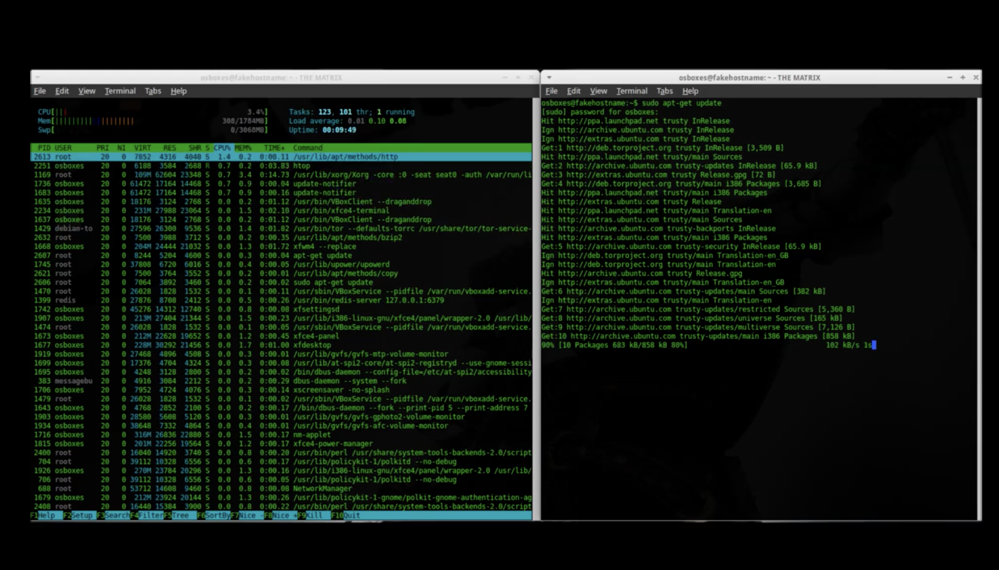

# Welcome to New Dev City!

This is my first published blog post and I want to thank you for reading it!

## Reasons for the Blog

After a few years working with web and digital technologies in education, development, and the art world I feel like it is time to start sharing my knowledge.

The internet was created by computer scientists to keep communication lines open during a nuclear war. 

It quickly became a way for other university researchers to communicate and collaborate over distance. In 1989, the World Wide Web was created and by the end of the 1990s a "Weird Web" flourished, a collection of websites on a huge diversity of topics displaying the love the creators had for the topics and for the medium. 

Since then, the web has become more interactive, more colorful, with an explosion of web technologies bringing mobile, animation, and video technologies to the forefront. But it has also been commercialized, losing much of its unique, personal touch. To keep the web vibrant and creative we need to have a web that lets all participate and share in its creation.

For that to work best, we need to feel safe and secure while we create and consume the web. We need to trust that our data is protected and our identities are respected. The future web is Secure, Inclusive, and Accessible for all creative collaborators. AND the future is NOW!

## Why call it New Dev City

Well, everyone that creates is a "dev," a developer, a person who takes their ideas and concepts and makes them into reality. Every day, new developers from around the world, from all classes and creeds and ethnicities and genders are pushing a future of technological inclusion by remaking these online communities for a new generation.

This blog is here to promote these new, cool forms and ways of organizing. Let's take the web over and add the personal back to it.

## What I'll Blog About

There will be a lot of posts for new and established web developers:
- Articles and Tutorials about vanilla HMTL, CSS, Javascript
- Deeper dives about libraries and frameworks
- Debugging Tips
- Tips N Tricks explaining snippets of code or terminal commands
- Looks at hot new web trends
- Explanations of Security issues - Data, InfoSec, AppSec
- Discussion about the Internet of Things (IOT)

I'll cover the social web as well with articles about:
- Boosting your collaboration skills
- Agile, SCRUM, and pair and mob programming tips
- Where to find the best resources for learning
- How to conquer impostor syndrome
- What the tech scene looks like in different countries
- Accessibility and Inclusion on the web
- How to take care of end-users

And I'll talk about my love for the intersection of art and code, both on and off the web. Look for posts about:
- Real time Video synthesis and feedback
- Pure Data - audio and visual flow programming
- Workflows for making glitchy visual art
- Processing & P5.js - code libraries for making visual art
- THREE.js & the HTML5 canvas
- Online bots
- Specific artists pushing the forefront or just making really cool stuff
- and other weird creative technologies that spark my interests

Thanks again for reading this and welcome to New Dev City!