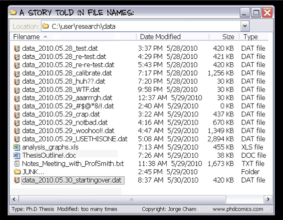

I love Git. Git is a version control application for software developers working on teams. The Git environment helps multiple developers stay up-to-date on recent revisions to a project code base, provides an easy way to resolve conflicts between different versions of the code, and maintains and makes searchable historical versions of the code base.

However, for most of us, Git is not super intuitive.

This is the first of many posts to help you understand git commands and operations. I'll talk about what Git is, how it relates to Github and other similar online code repositories that use Git, and discuss some basic Git commands.

<br>



## What is Git?

Git is a form of version control that helps you keep track of all the files and directories in a repo. But what is version control? Version control is a schema to help you keep track of data. Here's a [good blog post](https://rrcns.readthedocs.io/en/cns2012/version_control.html "Version Control article?") that discusses this in more detail.

The problem is naming, renaming and keeping track of edits to files in an easy, organized manner. The basic analogy is described in the cartoon above. Git solves this elegantly, without a need to rename our files and directories. It is mostly used to keep track of code, but people have written [novels using Git](https://github.com/KenMcConnell/KillDashNine/wiki "KenMcConnell / KillDashNine"), used Git to [keep track of recipes](https://github.com/Laurelai/recipehub "Laurelai / recipehub"), and collected a library of [free programming books](https://github.com/EbookFoundation/free-programming-books "EbookFoundation / free-programming-books") online using Git.

<br>

## What Git Does for You

You will [download Git](https://git-scm.com/downloads "Git downloads page") and install it in the root of your local machine. Once installed you can create a directory and initialize that directory to use Git. The basic workflow is to:
- write code
- save code
- repeat until you have a logical amount of working code
- add that code to the Git staging area
- commit the code with a clear and detailed message describing the code and what changes have been made in the repo since the last commit; this tracks the code.

```bash
git init
```
Initializes an empty repository or reinitializes an existing repository to use Git. Creates a .git directory and files in that directory that keep track of configuration, history, branches, etc. This is the collection of toppings that makes the git "sandwich" so yummy.

```bash
git add <file or directory>
```
Adds a file or a directory of files to the staging area. Once the code is added you can commit or you can easily remove the code from the staging area if you change your mind.

```bash
git commit -m "<message>"
```
Tracks the code by taking a snapshot of the directory at a specific point in time. Each commit can be searched by its [40 character SHA1 hash](https://ericsink.com/vcbe/html/cryptographic_hashes.html "link to article about Git cryptographic hashes"). The -m flag allows you to write a message at the command line describing the snapshot of code you are committing - Don't forget the flag or it will open up a Vim or Emacs code editor in your terminal and, unless you are one of those coders, trying to figure how to save and exit isn't fun.

<br>


## What Git Does for Your Team

Git can be used just on your local machine, but its real power comes when working with teams who share a code repository stored on a server in your dev shop or in the cloud. The most used online (cloud) repository using Git is [Github](https://github.com "Github website url"). You can also use Git as version control on [Bitbucket](https://bitbucket.org/product "Bitbucket website url") and [Gitlab](https://about.gitlab.com "Gitlab website url").

The hacky diagram above shows the basic workflow. Each member of the team can push their code, their commits, up to the repository and then pull the code of the other team members down to their local machines. It isn't always a seamless process, but Git helps keep track of the changes and the merging of the code. It also allows you to "roll the code back" to earlier commits.

<br>

## Other Basic Git Commands

```bash
git status
```

Checking the status of your git workflow is something you will do 100s of times a day. In fact, it is smart to git (HA!) in the habit of checking it before you enter other git commands, just to make sure you know where you are at in your workflow.

git status tells you what branch you are on, whether you are up to date with the master branch, whether you have changes to files that need to be committed, and whether you have pushed those changes to the remote repository.

If you spell status (or any other git command) wrong git will give you a list of commands that are similar to your misspelling:

```bash
git: 'tats' is not a git command. See 'git --help'.

The most similar command is
      status
```
This sounds trivial, but actually shortens the time it takes for you to realize your mistake. At the command line everything often looks the same. Reducing your "technical debt" is something that you need to start paying attention to at the beginning of your coding career.


```bash
git help
```
also
```bash
git help <command>
```
git help is your friend. Typing this at the command line will bring up a list of git commands with a short description. For a deeper dive, typing git help \<command\> will display the git manual entry on the specific command.

While Google search is also your friend, learning to read tech manuals will pay dividends in the long run as coding is so much about learning how to ask the right questions in the right jargon in the right place at the right time.

<br>

## What Comes Next?

If you noticed, once you initialized your Git repo, Git lets you know you are on the master branch. In later parts of the series, I'll talk more about branches and merging. And then after that I'll show you the two basic ways that developers connect repositories to Github.