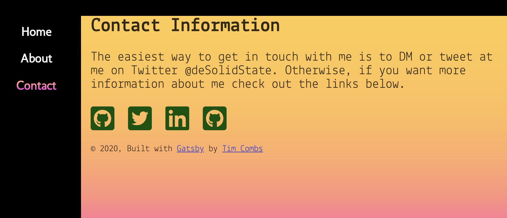
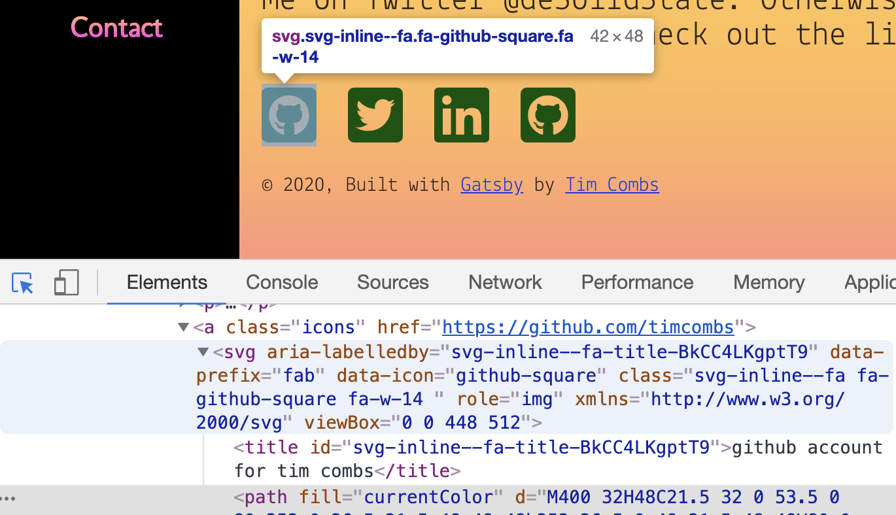

My blog was built using [Gatsby](https://www.gatsbyjs.org/ "Gatsby web site"). And I want to put some Fontawesome icons on the Contact page. This post talks about my challenges and successes. 

For those of you not aware of Gatsby, it is a framework based on [React](https://reactjs.org/ "React Web Site") that generates Progressive Web Apps (PWA) out-of-the-box helping developers build fast websites and apps that scale well. Under the hood it uses familiar technologies such as [Webpack](https://webpack.js.org/ "Webpack web site"), modern CSS and Javascript. It leverages the data abstraction layer [GraphQL](https://graphql.org/ "GraphQL web site"), to easily pull data from multiple sources, not just one database.

<br>

## Fontawesome Isn't Always My Friend

[Fontawesome](https://fontawesome.com/ "Fontawesome Web Site") is the most common font icon set for the web, but, like most of the times I've tried to use Fontawesome, I found the documentation a bit lacking, and I'm not the only one to [complain about the Fontawesome libraries](https://github.com/FortAwesome/react-fontawesome/issues/91/ "react-fontawesome issue #91 on Github").

<br>

## How to use Fontawesome in Gatsby

[This blog post](https://brockduncan.com/using-fontawesome-with-gatsby-and-react/ "Using Font Awesome with Gatsby and React") covers the basic React, and therefore Gatsby, use case - using the free-solid-svg-icons. They based the post on the [react-fontawesome Github page](https://github.com/FortAwesome/react-fontawesome "react-fontawesome Github page").

The process is pretty straight-forward:

**First** - install the dependencies to your repo.

```bash
npm i -S @fortawesome/fontawesome-svg-core
npm i -S @fortawesome/free-solid-svg-icons
npm i -S @fortawesome/react-fontawesome
```
fontawesome-svg-core is Fontawesome's newish SVG implementation.free-solid-svg-icons is the basic free icon set. react-fontawesome is the Fontawesome 5 React component. And, yes, @fortawesome is spelled correctly.

**Second** - let's create a `font-awesome.js` file to make a library of icons that we can reuse. I'll place this file in the `src/utils` directory. Go ahead and create one if it doesn't exist.

```javascript
import { library } from '@fortawesome/fontawesome-svg-core'
import { faCoffee } from '@fortawesome/free-solid-svg-icons'
library.add(faCoffee)
```
We import the coffee icon and add it to the library of icons.

**Third** - let's use the icon in a component. Let's take a look at how I use this on my Contact page.

```jsx
import React from 'react';
import Layout from '../components/layout';
import { FontAwesomeIcon } from '@fortawesome/react-fontawesome';
import '../utils/font-awesome';

const Contact = () => (
  <Layout>
    <h1>Contact Information</h1>

    <a className='icons' 
       href='https://myfavcoffeeplace.io'>
      <FontAwesomeIcon icon={'coffee'} />
    </a>
  </Layout>
);

export default Contact;
```
I use the `Layout.js` component and easily add the coffee icon to my Contact page. Try it yourself, you'll see it works. But why do I need the coffee icon on my Contact page? I don't see this as the basic use case.

<br>



## The Real Basic Use Case

Almost every time I've used Fontawesome icons it is because I need some brand icons. What I really want for my Contact page are Twitter, Github and LinkedIn icons. This is frustrating, because it takes a while to figure out the implementation as these are not in the free-solid-svg-icons icon set and you have to use a slightly different syntax.

This is explained in more detail near the bottom of the react-fontawesome README, but not in the documentation on the website.

**First** - download the correct icon set

```bash
npm i --save @fortawesome/free-brands-svg-icons
```
In this case, I need the brand icons, but you can also download the free-regular-svg-icons if you need those as well.

**Second** - use the correct syntax to add the icon to the Contact page.
```jsx
import React from 'react';
import Layout from '../components/layout';
import { FontAwesomeIcon } from '@fortawesome/react-fontawesome';
import '../utils/font-awesome';

const Contact = () => (
  <Layout>
    <h1>Contact Information</h1>

    <a className='icons' 
       href='https://github.com/timcombs'>
      <FontAwesomeIcon icon={['fab', 'github-square']} />
    </a>

    <a className='icons'
       href='https://twitter.com/deSolidState'>
      <FontAwesomeIcon icon={['fab', 'twitter-square']} />
    </a>

    <a className='icons' 
       href='https://www.linkedin.com/in/timothycombs/'>
      <FontAwesomeIcon icon={['fab', 'linkedin']} />
    </a>

    <a className='icons' 
       href='https://github.com/desolidstate'>
      <FontAwesomeIcon icon={['fab', 'github-square']} />
    </a>
  </Layout>
);

export default Contact;
```
Notice the syntax change to the FontAwesomeIcon component. Instead of adding a string to the ```icon=``` attribute as before, I had to add an array with two strings. The first string designates the icon set, 'fab' - FontAwesome Brands and the second string is the icon name. For the free-regular-svg-icons icon set the first string is 'far' - FontAwesome Regular.

<br>

## Don't Forget to add Accessibility!

Luckily, the react-fontawesome library makes it really easy to add accessibility to the icons you use in React and Gatsby. All you do is add a ```title='some title'``` attribute to the icon component and this title is used to aria-label the icon properly during the build process.

```jsx
  ...
  <a className='icons' 
      href='https://github.com/timcombs'>
    <FontAwesomeIcon 
      icon={['fab', 'github-square']} 
      title='github account for deSolidState' />
  </a>
  ...
```
Here's what it looks like when you inspect the element using your dev tools:
