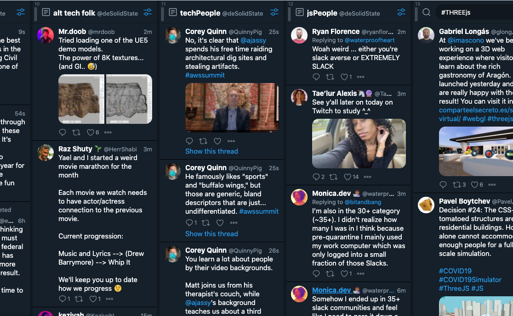
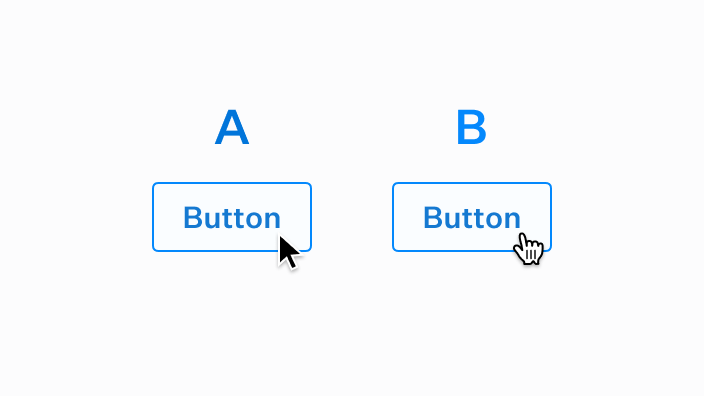
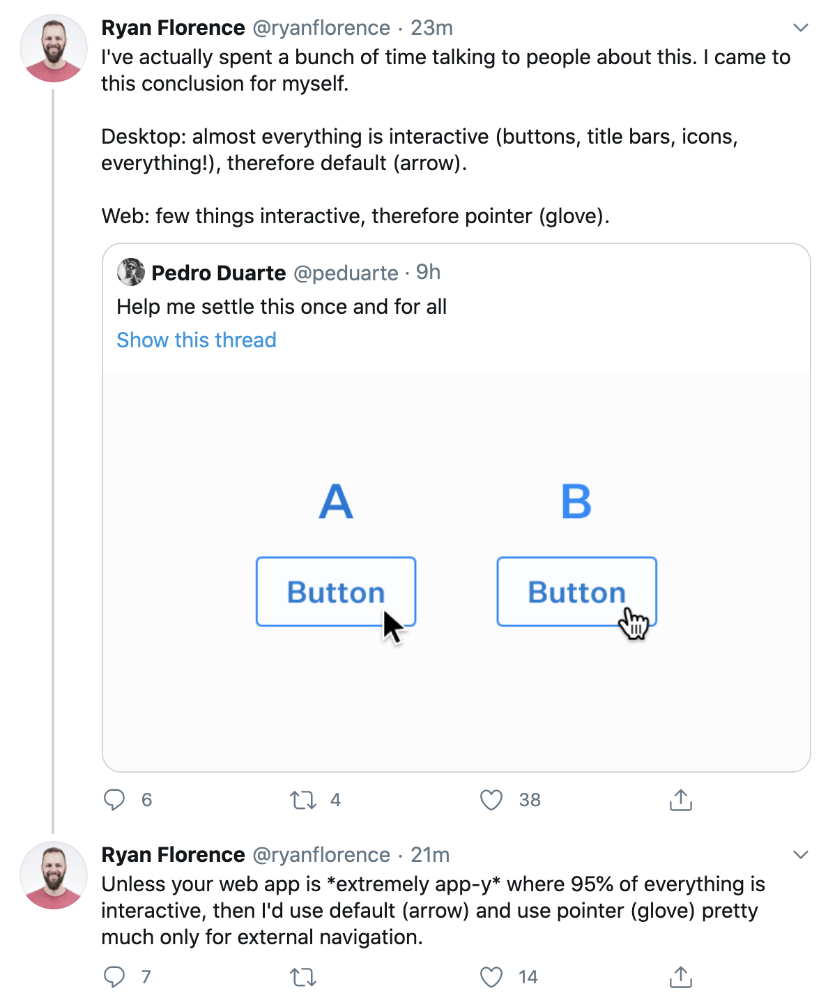
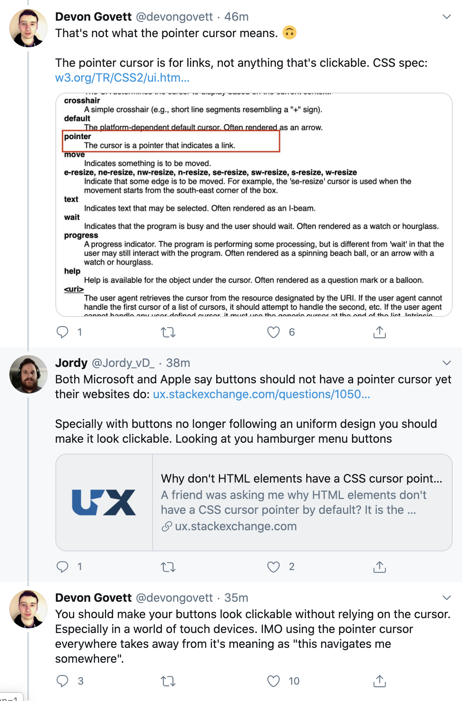

I tell everyone how important it is to build an online community of creators who will support and encourage you on your creative journey. This is as true for coders as it is for artists. My favorite place for coding is Twitter, but other people find Slack channels, Discord and Facebook groups, and even LinkedIn to be helpful for sharing information, keeping up with current trends and providing peer support.

 

## Tweetdeck Makes Using Twitter Easier

When I tell my friends I'm on Twitter all the time they tell me that I'm a fool (well, they use stronger language but...), and, honestly, Twitter is kind of a dumpster fire. 2/3rd of the traffic are bots - some creative, some nefarious, most are for marketing - and trends and topics catch fire so quickly that the trolls come out to cavort around the fire.

I use Twitter much differently. I never see the trending items. I never use it on my phone. I never get caught up in the scandal of the week (well, not too much.)

I use Tweetdeck. Tweetdeck is a marketing tool, but it allows me to create multiple feeds to watch. I have 20 - 30 feeds going at any one time, even though I don't look at them each day, I can easily keep up with trends, thought-leaders, peers in my field, upcoming shows and conferences. I am in control, not the Twitter algorithm.

To use Tweetdeeck, link your Twitter account to it and, voilà, you can start creating columns for hashtags, people, topics, followers, messages and more! I've found jobs using Twitter, made friends on Twitter and learned the basics of many technologies and tricks for using them more effectively.

 

## Arrow vs Pointer Cursors

Which brings me to the Arrow vs Pointer cursor conversation I watched on Twitter the other day. This was the inspiration for this blog post. To many of you it may seem a bit esoteric or nit-picky, but it really shows how the web works.

This post came across my feed with a very definitive "answer." He was in a "debate" about which cursor to use and, as he says clearly, he came to a conclusion that worked for him. Which is to use arrow cursors on a desktop GUI because almost everything is interactive and to use pointer cursors on the web because few things are interactive.

Often we want very clear info when we are creating a website or app, but web problem-solving isn't always cut and dried. We are dealing with human psychology and zeitgeist, so what worked 5 years ago, let alone 20 years ago, on the web doesn't apply to now. Now we create the web for many more types of users than before. We have accessibility concerns, people from other cultures who may be used to non-Western iconography, different age groups, mobile vs tablet vs desktop users, and more. And often the question is who is your main audience or user group?

Note: Devon goes straight to the CSS specifications. Jordy mentions how even major players in the sector contradict their own in-house guidelines. Then Devon concludes that buttons need to look clickable regardless. These different use cases are important and new technologies have and will continue to spring up to solve these issues. Twitter brings these conversations to me daily, and because I remain open to them, I become more compassionate, and better, in my own work as I am reminded of all the different communities and the use cases that support them.

More importantly, this conversation also reminds me that the web is constantly evolving. It is a collection of protocols, paradigms, best practices, specifications, and hacks of the moment. It is best to find a place that you can keep up with these trends.