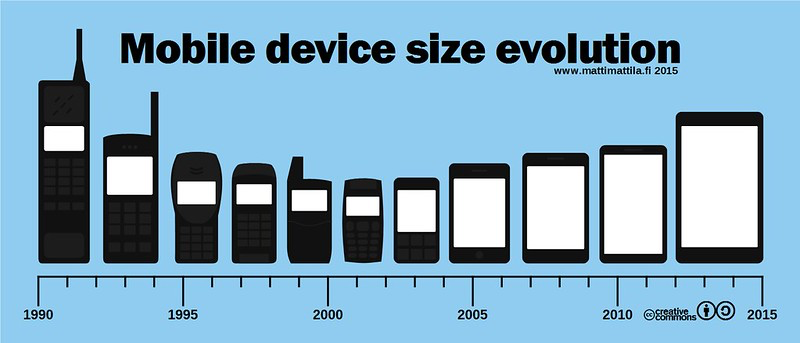

Say you’re looking to provide three different responsive page layouts: one for smartphones, one for tablets or laptops, and one for desktops. Which screen widths should you target as your breakpoints (e.g., 480px)? But then you think, which tablets, which smart phones, which laptops, which desktops? So many devices sizes!

Just remember we don't define breakpoints on the basis of device size. We design the breakpoints to display content in the best way. Let the content guide the breakpoints. And remember to think mobile first.

That being said, we still need a place to start, but, unfortunately, there’s no defined standard for the page widths to target, but this example is fairly common: 320, 480, 600, 768, 900, 1024, and 1200px. That is seven breakpoints.

Another example from [320 and Up](https://responsivedesign.is/resources/boilerplates/320-and-up/ "Link to 320 and Up website") has five default media query breakpoints: 480, 600, 768, 992, and 1382px. Along with these two schema, I could enumerate at least ten other approaches I've seen online. 

With any of these reasonable sets of breakpoints, you can target most devices for your content. In practice, there is usually no need to separately handle all of the aforementioned examples of page widths - seven different resolutions is probably overkill. In my experience, 320px, 768px, and 1200px are the most commonly used.