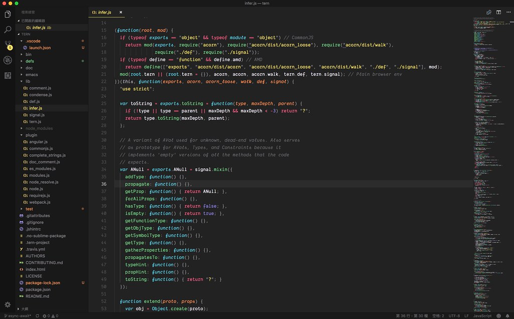
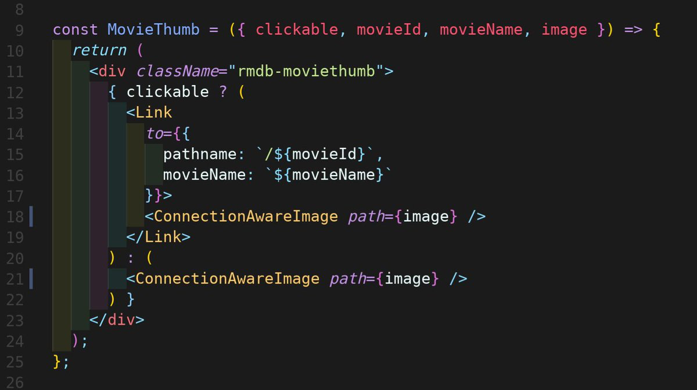
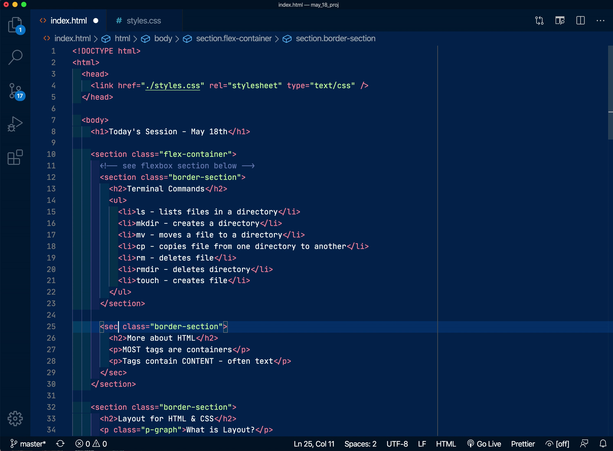
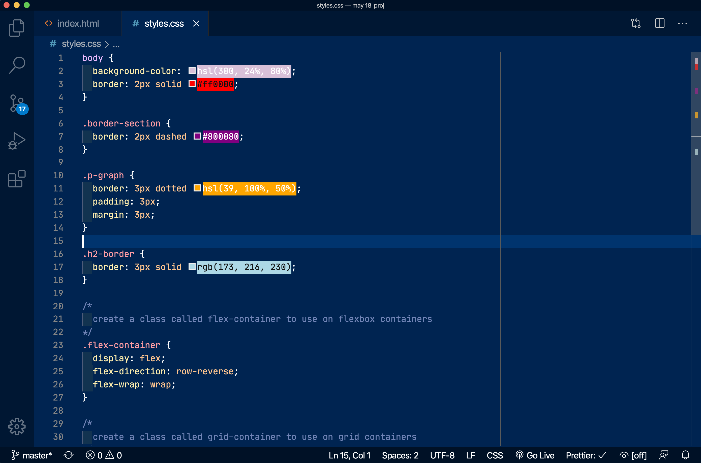
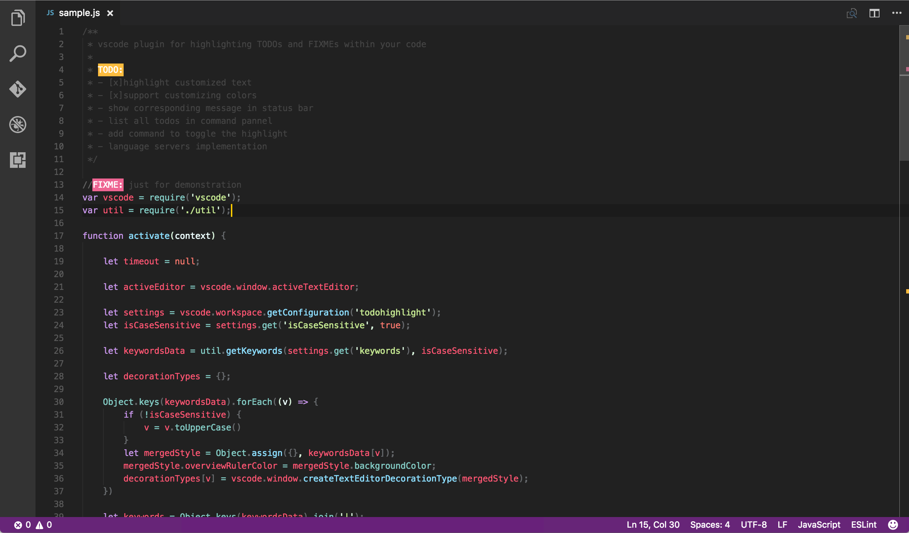

One of the great things about web development in 2020 is how easy it is to not just get started learning, but how easy it is to write code. I'm a big fan of [Virtual Studio Code (VSCode)](https://code.visualstudio.com/ "Virtual Studio Code website"), an Integrated Developer Environment (IDE) that is particularly good for beginning coders. Besides combining a text editor, directory, and command line, it autocompletes your code and gives you suggestions, prompts, and direct links to Mozilla Developer Network (MDN) for more information.

As you get used to coding you'll want more and VSCode delivers. It has lots of color themes, integration with various source control programs, great debugging tools, and is really customizable so you can set up your coding environment exactly the way you want.

When you are starting out as a new coder, the hardest thing to do is to get those serotonin rushes that come with completing a task or understanding your code or getting your code to run properly. Coders aim for fluidity, in both understanding and writing code. Anything that gets in the way is technical debt. Do not underestimate how much this keeps new coders from continuing the hard work of learning and the hard work of problem solving.

VSCode extensions help remove technical debt by making the code more readable and by helping you with little tasks that slow you down. VSCode will even suggest extensions or you can search for your own. Now, I do agree with some developers that extensions can also be a crutch that gets in the way of understanding, so I don't suggest that new coders completely automate their coding environment, but here are 5 of my favorite VSCode extensions for beginners:

 

## HTML Preview

Lots of coders start learning in code playgrounds like Codepen or JSFiddle. [HTML Preview](https://marketplace.visualstudio.com/items?itemName=tht13.html-preview-vscode "indent-rainbow VSCode marketplace page") will quickly and easily show you how the HTML looks in VSCode. Most coders quickly move on from it once they learn more about the web, but it is still great when I wanna see a snippet of code displayed.

 

## indent-rainbow

[indent-rainbow](https://marketplace.visualstudio.com/items?itemName=oderwat.indent-rainbow "indent-rainbow VSCode marketplace page") colorizes the indentation of your code. A different color for each indent level. Really helps you see the nesting of html and python files. Very customizable so you can make the color scheme as bold or subtle as you like.

 

## Auto Rename Tag

[Auto Rename Tag](https://marketplace.visualstudio.com/items?itemName=formulahendry.auto-rename-tag "Auto Rename Tag VSCode marketplace page") does exactly what it says on the tin. When you change one of your HTML, XML, or JSX tags it will change the other tag of the pair. Doesn't matter whether you are changing the opening or closing tag.

 

## Color Highlight

[Color Highlight](https://marketplace.visualstudio.com/items?itemName=naumovs.color-highlight "Color Highlight VSCode marketplace page") simply highlights the css/web colors in your code when they are written in hex, RGB, RGBA, HSL or HSLA format. 

 

## TODO Highlight

[TODO Highlight](https://marketplace.visualstudio.com/items?itemName=wayou.vscode-todo-highlight "TODO Highlight VSCode marketplace page") is syntax highlighting for TODOs, FIXMEs, and ANY keyword you specify in the configuration file. Write TODO: somewhere and it will highlight it, but will also create a list of what you need to work on in a project. Some developers like to write out the user stories as TODOs to keep them on track. 