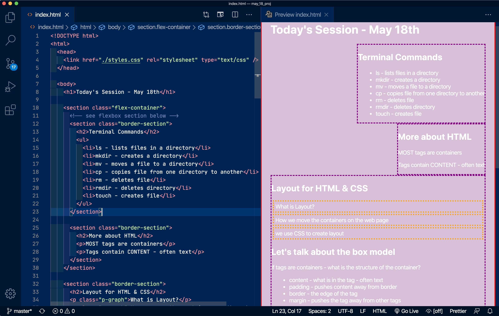

One of the great things about web development in 2020 is how easy it is to write code. I'm a big fan of [Virtual Studio Code (VSCode)](https://code.visualstudio.com/ "Virtual Studio Code website"), an Integrated Developer Environment (IDE) that is particularly good for beginning coders. Besides combining a text editor, directory, and command line in one application, it also autocompletes your code and gives suggestions, prompts, and direct links to Mozilla Developer Network (MDN) for more information.

As you get used to coding you'll want more and VSCode delivers. It has lots of color themes, integration with various source control programs, great debugging tools, and is customizable so you can set up your coding environment exactly the way you want.

Problem solving *is* really hard work and sometimes it is a demoralizing grind. When you are starting out, it is important to have lots of little successes as you struggle to learn and get your code to run without bugs. Success gives you a serotonin rush which helps to keep you motivated in the struggle to learn more. As coders, we strive for fluidity when reading and writing code. Anything that gets in the way of this fluidity is technical debt that slows down our problem solving.

VSCode extensions help remove technical debt by making the code more readable and by helping you with little tasks that slow you down. VSCode will even suggest extensions or you can search for your own. Now, I do agree with some developers that extensions can also be a crutch that gets in the way of understanding, so I don't suggest that new coders completely automate their coding environment!

That being said, here are 5 of my favorite VSCode extensions for beginners:

 

## HTML Preview

Lots of coders start learning in code playgrounds like Codepen or JSFiddle. [HTML Preview](https://marketplace.visualstudio.com/items?itemName=tht13.html-preview-vscode "indent-rainbow VSCode marketplace page") will quickly and easily show you how the HTML looks in VSCode. Most coders quickly outgrow this extension once they learn more about the web, but it is still great when I wanna see a snippet of HTML and CSS displayed.

 

## indent-rainbow

[indent-rainbow](https://marketplace.visualstudio.com/items?itemName=oderwat.indent-rainbow "indent-rainbow VSCode marketplace page") colorizes the indentation of your code. A different color for each indent level. Really helps you see the nesting of html and python files. Very customizable so you can make the color scheme as bold or subtle as you like.

 

## Auto Rename Tag

[Auto Rename Tag](https://marketplace.visualstudio.com/items?itemName=formulahendry.auto-rename-tag "Auto Rename Tag VSCode marketplace page") does exactly what it says on the tin. When you change one of your HTML, XML, or JSX tags it will change the other tag of the pair. Doesn't matter whether you are changing the opening or closing tag.

 

## Color Highlight

[Color Highlight](https://marketplace.visualstudio.com/items?itemName=naumovs.color-highlight "Color Highlight VSCode marketplace page") simply highlights the css/web colors in your code when they are written in hex, RGB, RGBA, HSL or HSLA format. 

 

## TODO Highlight

[TODO Highlight](https://marketplace.visualstudio.com/items?itemName=wayou.vscode-todo-highlight "TODO Highlight VSCode marketplace page") is syntax highlighting for TODOs, FIXMEs, and ANY keyword you specify in the configuration file. Write "TODO:" somewhere and it will highlight it, and will also create a list of the TODOs waiting for completion in your project. Some developers like to write out the user stories as TODOs to keep them on track. 