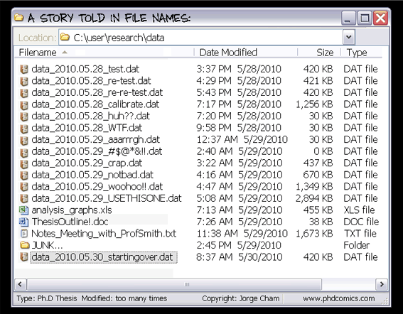

I love Git. Git is a version control application for software developers working on teams. The Git environment helps multiple developers stay up-to-date on recent revisions to a project code base, provides an easy way to resolve conflicts between different versions of the code, and maintains and makes searchable historical versions of the code base.

However, for most of us, Git is not super intuitive.

This is the first of many posts to help you understand git commands and operations. I'll talk about what Git is, how it relates to Github and other similar online code repositories that use Git, and discuss some basic Git commands.



## What is Git?

Git is a form version control that helps you keep track of all the files in a directory. But what is version control? Version control is a schema to help you keep track of data. Here's a [good blog post](https://rrcns.readthedocs.io/en/cns2012/version_control.html/ "Version Control?") that goes into more detail.

The basic analogy is described in the cartoon above, and Git is mostly used to keep track of code, but people have written [novels using Git](https://github.com/KenMcConnell/KillDashNine/wiki "KenMcConnell / KillDashNine"), used Git to [keep track of recipes](https://github.com/Laurelai/recipehub "Laurelai / recipehub"), and to store a collection of [free programming books](https://github.com/EbookFoundation/free-programming-books "EbookFoundation / free-programming-books").

## What it does for you?

You will [download Git](https://git-scm.com/downloads/ "Git downloads page") and install it in the root of your local machine. Once installed you can create a directory and initialize that directory to use Git. The basic workflow is to:
- write code
- save code
- repeat until you have a logical amount of working code
- add that code to Git so it can track it
- commit that code, leaving a message that discusses what it is or does or what changes have been made since the last commit

```bash
git init
```
Initializes an empty repository or reinitializes an existing repository to use Git. Creates a .git directory and files in that repository that keep track of configuration, history, branches, etc. This is the collection of toppings that makes the git "sandwich" so yummy.

## So what?

Git can be used on your local machine only, but its real power comes when working with teams all sharing one repo

## Other Basic Git Commands

```bash
git help
```

also

```bash
git help <command>
```

git help is your friend. Typing this at the command line will bring up a list of git commands with a short description. For a deeper dive, typing git help \<command\> will display the git manual entry on the specific command.

While Google search is also your friend, learning to read tech manuals will pay dividends in the long run as coding is so much about learning how to ask the right questions in the right jargon in the right place at the right time.

```bash
git status
```

Checking the status of your git workflow is something you will do 100s of times a day. In fact, it is smart to git (HA!) in the habit of checking it before you enter other git commands, just to make sure you know where you are at in your workflow.

git status tells you what branch you are on, whether you are up to date with the master branch, whether you have changes to files that need to be committed, and whether you have pushed those changes to the remote repository.

If you spell status (or any other git command) wrong git will give you a list of commands that are similar to your misspelling:

```bash
git: 'tats' is not a git command. See 'git --help'.

The most similar command is
        status
```

This sounds trivial, but actually shortens the time it takes for you to realize your mistake. At the command line everything often looks the same. Reducing your "technical debt" is something that you need to start paying attention to at the beginning of your coding career.

```bash
git branch
```

Displays a list of current active branches and notes which branch you are currently using.

```bash
git branch <branchname>
```

If \<branchname\> does not exist, then git creates a new branch using that name, but will **not** switch to the new branch. If branch already exists, will output an error message.

```bash
git checkout <branchname>
```

Switches to a new branch.

```bash
git checkout -b <branchname>
```

I use this all the time. It creates a new branch then switches to that branch. If branch already exists, outputs error message and stays on current branch.

```bash
git branch -d <branchname>
```

Deletes a branch.
